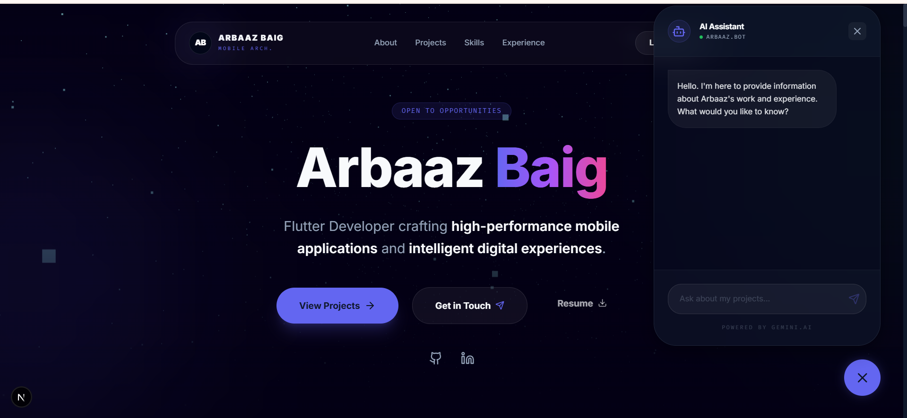

# Arbaaz Baig | Senior Developer Portfolio

An "Infinite Tier" developer portfolio built with a focus on high-fidelity interactions, 3D physics, and intelligent user experience.

 *(Note: Ensure you have a preview image at this path)*

## 🚀 Elevated Features

- **3D Physics-based Tilt Cards**: Interactive project and skill cards powered by Framer Motion and custom spring physics.
- **AI-Powered Assistant**: An integrated AI concierge ("Arbaaz.Bot") that handles inquiries and provides an intelligent layer to the portfolio.
- **Magnetic Button Physics**: Premium micro-interactions where primary call-to-actions subtly follow the user's cursor.
- **Bento Grid Architecture**: A modern, Apple-inspired skills layout that highlights core competencies in Flutter and Dart.
- **Architecture Highlights**: Specialized section showcasing technical deep-dives into authentication, API optimization, and real-time systems.
- **High-Fidelity Mockups**: Custom Phone and Browser mockups with detailed internal UI representations.

## 🛠️ Technical Stack

- **Framework**: [Next.js 15+](https://nextjs.org/) (App Router)
- **Frontend**: [React 19](https://react.dev/), [Tailwind CSS](https://tailwindcss.com/)
- **Animations**: [Framer Motion](https://www.framer.com/motion/)
- **3D Elements**: [Three.js](https://threejs.org/) / [React Three Fiber](https://docs.pmnd.rs/react-three-fiber)
- **Icons**: [Lucide React](https://lucide.dev/)
- **Contact**: [EmailJS](https://www.emailjs.com/)

## 📦 Getting Started

1. **Clone the repository:**
   ```bash
   git clone https://github.com/TZ-ArbaazBaig/Personal_portfolio.git
   ```

2. **Install dependencies:**
   ```bash
   npm install
   ```

3. **Set up environment variables:**
   Create a `.env.local` for EmailJS keys:
   ```env
   NEXT_PUBLIC_EMAILJS_SERVICE_ID=your_service_id
   NEXT_PUBLIC_EMAILJS_TEMPLATE_ID=your_template_id
   NEXT_PUBLIC_EMAILJS_PUBLIC_KEY=your_public_key
   ```

4. **Run the development server:**
   ```bash
   npm run dev
   ```

## 📄 License

Distributed under the MIT License. See `LICENSE` for more information.

---
Built with 💎 by Arbaaz Baig
